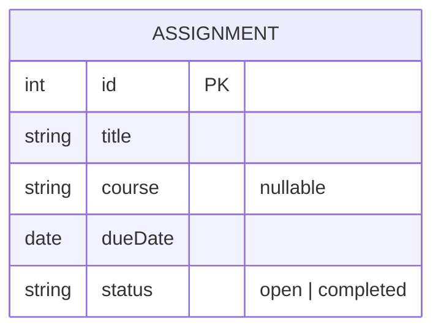

# Domain Model — Assignment Task Manager

Diagram source: [`domain-model.mmd`](domain-model.mmd)
Rendered image: [`domain-model.png`](domain-model.png) / [`domain-model.svg`](domain-model.svg)

## Why this is the whole model

One entity, five attributes. Every attribute traces to a specific line in
[`REQUIREMENTS.md`](REQUIREMENTS.md):

| Attribute | Traces to |
|---|---|
| `id` | US-1: "it is saved and returned with a unique ID" |
| `title` | US-1 (required — HTTP 400 if omitted) |
| `course` | US-1 ("optionally a course"), US-4 (filter by course) — nullable |
| `dueDate` | US-1 (required, ISO-8601), US-2 (sort key), US-8 (overdue comparison) |
| `status` | US-3 (`open`/`completed`), US-5 (filter by status) |

Two deliberate omissions, both load-bearing:

- **No `overdue` column.** US-8's acceptance criteria describe it as a
  comparison made *at view time* ("when I view the list, then its returned
  record includes `overdue: true`"), not a fact recorded once. An assignment
  becomes overdue purely because time passed, with no write to the row —
  storing it would silently go stale between requests. It's a computed
  property of `(dueDate, status, now)`, not a column.
- **No `COURSE` entity.** Nothing in US-1 through US-8 creates, edits, lists,
  or deletes a course independently of an assignment. US-4 only ever supplies
  a course name to filter by. Promoting it to its own table would add a
  foreign key and referential-integrity questions (what happens to a `COURSE`
  row when its last assignment is deleted?) that no requirement asks for.

See `DOMAIN_MODEL_CRITIQUE.md` for how this compares to the AI's unedited
first draft in `DOMAIN_MODEL_RAW.md`.
