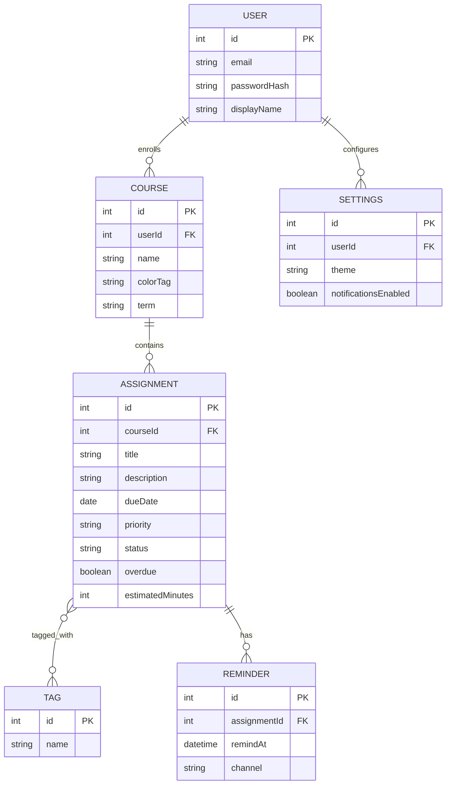

# AI's First Draft — Domain Model

**Prompt given (cold, first attempt, requirements attached in full):**
> Here are the requirements for my app [`REQUIREMENTS.md` pasted in full]. Draft a
> domain model for it as a Mermaid ER diagram.

**Response:** kept verbatim below, exactly as produced, before any edits. See
`domain-model-raw.mmd` for the Mermaid source and `domain-model-raw.png` /
`domain-model-raw.svg` for the rendered diagram.

Six entities, five relationships: a `USER` who owns multiple `COURSE`s, each
`COURSE` containing multiple `ASSIGNMENT`s, `ASSIGNMENT`s tagged through a
many-to-many `TAG` join, `ASSIGNMENT`s owning `REMINDER`s, and a `USER`
configuring one `SETTINGS` row. This draft was not edited before being saved
here — the critique in `DOMAIN_MODEL_CRITIQUE.md` evaluates it against the
model actually adopted in `domain-model.mmd`.
